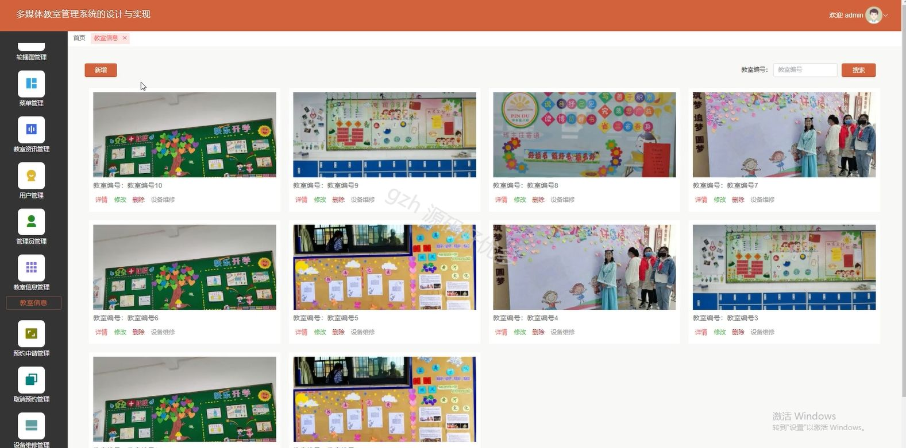

# springbootA053D
springbootA053D多媒体教室管理系统
## 查看主页获取源码

### 一、关键词

教室信息、预约信息、多媒体教室

 

### 二、作品包含

源码+数据库+设计文档万字+全套环境和工具资源+部署教程

 

### 三、项目技术

前端技术：Html、Css、Js、Vue3.0、Element-plus
后端技术：Java、SpringBoot3.0、MyBatis

  

 

### 四、运行环境（以下版本亲测，其他版本未知，请自测）

开发工具：IDEA/eclipse  + VSCODE

数据库：MySQL5.7（最低要5.7版本）

数据库管理工具：Navicat10以上版本

环境配置软件： jdk17 + Maven3.6.3

前端Nodejs：20

浏览器：谷歌浏览器

 

### 五、项目介绍

项目编号：springbootA053D

多媒体教室管理系统用于便捷地预订、管理和维护教室及其中设备。

角色：管理员、用户

管理员：首页、轮播图管理、菜单管理、教室资讯管理、用户管理、管理员管理、教室信息管理、预约申请管理、取消绑定管理、设备维修管理。

用户：首页、教室资讯、教室信息、个人中心、修改密码、预约申请、取消预约、我的收藏。

 

### 六、运行截图

